# 🔐 Documentation : Validation de la Granularité des Permissions

**Version**: 1.0.0  
**Date**: 2025-11-04  
**Projet**: RDS Viewer Anecoop  
**Auteur**: Système de Validation Automatique  

---

## 📋 Table des Matières

1. [Vue d'ensemble](#vue-densemble)
2. [Architecture du Système](#architecture-du-système)
3. [Types de Permissions](#types-de-permissions)
4. [Validation des Patterns](#validation-des-patterns)
5. [Tests Automatisés](#tests-automatisés)
6. [Configuration Avancée](#configuration-avancée)
7. [Exécution en Production](#exécution-en-production)
8. [Dépannage](#dépannage)
9. [Bonnes Pratiques](#bonnes-pratiques)
10. [Annexes](#annexes)

---

## 🎯 Vue d'ensemble

### Objectif

Le système de validation de la granularité des permissions assure que :

- ✅ **Cohérence** entre les définitions de rôles et leurs permissions
- ✅ **Sécurité** par la validation stricte des formats de permissions
- ✅ **Performance** par l'optimisation des vérifications d'accès
- ✅ **Maintenabilité** par la détection automatique des anomalies
- ✅ **Granularité** par la validation des niveaux d'accès fins

### Portée

Ce système valide :

```mermaid
graph TD
    A[Configuration Permissions] --> B[Structure Rôles]
    A --> C[Formats Permissions]
    A --> D[Hiérarchie Héritage]
    B --> E[Priorités Cohérentes]
    B --> F[Champs Obligatoires]
    C --> G[Patterns Wildcards]
    C --> H[Actions Granulaires]
    D --> I[Escalation Permissions]
    D --> J[Exceptions Spéciales]
```



---

## 🏗️ Architecture du Système

### Composants Principaux

```javascript
// 1. Modèle de permissions (src/models/permissions.js)
export const PERMISSIONS = {
  // Modules principaux
  DASHBOARD: 'dashboard',
  SESSIONS: 'sessions',
  COMPUTERS: 'computers',
  LOANS: 'loans',
  USERS: 'users',
  AD_MANAGEMENT: 'ad_management',
  CHAT_GED: 'chat_ged',
  AI_ASSISTANT: 'ai_assistant',
  REPORTS: 'reports',
  SETTINGS: 'settings',
  CONFIG: 'config',

  // Actions granulaires
  VIEW: 'view',
  CREATE: 'create',
  EDIT: 'edit',
  DELETE: 'delete',
  EXPORT: 'export',
  ADMIN: 'admin'
};

// 2. Définition des rôles
export const ROLES = {
  SUPER_ADMIN: {
    permissions: ['*'], // Accès total
    priority: 100
  },
  ADMIN: {
    permissions: ['dashboard:*', 'sessions:*', 'users:*'], // Wildcards
    priority: 90
  },
  MANAGER: {
    permissions: ['dashboard:view', 'sessions:view', 'loans:*'], // Mixte
    priority: 70
  },
  VIEWER: {
    permissions: ['dashboard:view', 'sessions:view'], // Granulaire
    priority: 10
  }
};
```

### Flux de Validation

```mermaid
sequenceDiagram
    participant User as Utilisateur
    participant API as API
    participant Validator as Validateur
    participant Config as Configuration
    participant Cache as Cache

    User->>API: Demande d'accès
    API->>Validator: Vérifier permission
    Validator->>Config: Charger config
    Config->>Validator: Retourner rôles
    Validator->>Cache: Vérifier cache
    Cache->>Validator: Résultat cache
    alt Cache miss
        Validator->>Validator: Calculer permission
        Validator->>Cache: Stocker résultat
    end
    Validator->>API: Autorisation
    API->>User: Accès accordé/refusé
```



---

## ⚙️ Types de Permissions

### 1. Permissions Wildcards

```javascript
// Format: module:*
const WILDCARD_PATTERNS = {
  'dashboard:*': {
    description: 'Accès complet au tableau de bord',
    matches: [
      'dashboard:view',
      'dashboard:edit',
      'dashboard:create',
      'dashboard:delete',
      'dashboard:export'
    ],
    excludes: ['sessions:*', 'users:*']
  },
  
  'sessions:*': {
    description: 'Gestion complète des sessions',
    matches: [
      'sessions:view',
      'sessions:edit',
      'sessions:create',
      'sessions:delete',
      'sessions:disconnect'
    ],
    cost: 'performance' // Plus cher qu'une permission exacte
  }
};
```

### 2. Permissions Granulaires

```javascript
// Format: module:action
const GRANULAR_PERMISSIONS = {
  // Actions de base
  'users:view': 'Consultation des utilisateurs',
  'users:create': 'Création d\'utilisateurs',
  'users:edit': 'Modification d\'utilisateurs',
  'users:delete': 'Suppression d\'utilisateurs',
  'users:export': 'Export des utilisateurs',
  
  // Actions spéciales GED
  'ged_upload:create': 'Upload de documents GED',
  'ged_delete:delete': 'Suppression de documents GED',
  'ged_network_scan:admin': 'Scan réseau GED',
  'ged_index_manage:admin': 'Gestion des index GED',
  
  // Actions IA
  'ai_assistant:view': 'Accès à l\'assistant IA',
  'ai_assistant:admin': 'Administration IA'
};
```

### 3. Permissions Spéciales

```javascript
// Super admin
const SUPER_ADMIN = {
  permission: '*',
  description: 'Accès à toutes les permissions',
  risks: ['Sécurité maximale requise', 'Audit obligatoire'],
  alternatives: ['Rôles spécifiques', 'Permissions granulaire']
};

// Configuration système
const SYSTEM_CONFIG = {
  'config:view': 'Consultation de la configuration',
  'config:edit': 'Modification de la configuration',
  'config:admin': 'Administration complète'
};
```

### 4. Héritage de Permissions

```javascript
// Structure hiérarchique
const INHERITANCE_HIERARCHY = {
  super_admin: {
    level: 100,
    inherits: [],
    permissions: ['*']
  },
  
  admin: {
    level: 90,
    inherits: ['super_admin'],
    permissions: ['dashboard:*', 'sessions:*', 'users:*']
  },
  
  manager: {
    level: 70,
    inherits: ['admin', 'ged_specialist'],
    permissions: ['dashboard:view', 'loans:*', 'users:view']
  },
  
  technician: {
    level: 50,
    inherits: ['manager'],
    permissions: ['sessions:edit', 'computers:view']
  },
  
  viewer: {
    level: 10,
    inherits: ['technician'],
    permissions: ['dashboard:view', 'sessions:view']
  }
};
```

---

## 🧪 Validation des Patterns

### Tests de Wildcards

```javascript
// Test wildcard module
const wildcardTests = {
  userPermissions: ['dashboard:*'],
  testCases: [
    {
      permission: 'dashboard:view',
      expected: true,
      reason: 'Wildcard couvre toutes les actions'
    },
    {
      permission: 'sessions:view',
      expected: false,
      reason: 'Module différent, non couvert'
    }
  ]
};
```

### Tests Granulaires

```javascript
// Test permissions exactes
const granularTests = {
  userPermissions: ['users:create', 'loans:view'],
  testCases: [
    {
      permission: 'users:create',
      expected: true,
      reason: 'Permission exacte correspondante'
    },
    {
      permission: 'users:edit',
      expected: false,
      reason: 'Action différente non incluse'
    },
    {
      permission: 'loans:view',
      expected: true,
      reason: 'Permission exacte correspondante'
    }
  ]
};
```

### Tests d'Combinaisons Logiques

```javascript
// Test logique OU
const orLogicTest = {
  requiredPermissions: ['users:create', 'loans:view'],
  userPermissions: [
    ['users:create'], // → true
    ['loans:view'],   // → true
    ['users:create', 'loans:view'], // → true
    ['users:edit']    // → false
  ]
};

// Test logique ET
const andLogicTest = {
  requiredPermissions: ['sessions:view', 'users:view'],
  userPermissions: [
    ['sessions:view', 'users:view'], // → true
    ['sessions:view'],               // → false
    ['users:view'],                  // → false
    []                               // → false
  ]
};
```

### Tests d'Exceptions

```javascript
// Test permissions spéciales
const exceptionTests = {
  userPermissions: ['config:view'], // Vue seulement
  testCases: [
    {
      permission: 'config:view',
      expected: true,
      reason: 'Permission exacte'
    },
    {
      permission: 'config:edit',
      expected: false,
      reason: 'Action non autorisée'
    },
    {
      permission: 'config:admin',
      expected: false,
      reason: 'Administration non autorisée'
    }
  ]
};
```

---

## 🔬 Tests Automatisés

### Tests de Granularité (`granular-permissions.test.js`)

```bash
# Exécution avec Jest
npm test tests/permissions/granular-permissions.test.js

# Mode verbeux
npm test tests/permissions/granular-permissions.test.js -- --verbose

# Tests spécifiques
npm test tests/permissions/granular-permissions.test.js -- --testNamePattern="wildcards"
```

**Couverture des tests :**

```javascript
const TEST_CATEGORIES = {
  basic: {
    description: 'Tests de base des permissions',
    tests: ['wildcard_module', 'exact_permission', 'super_admin']
  },
  
  granularActions: {
    description: 'Tests des actions granulaires',
    tests: ['create_action', 'read_action', 'update_action', 'delete_action']
  },
  
  inheritance: {
    description: 'Tests d\'héritage des permissions',
    tests: ['manager_inheritance', 'ged_specialist_inheritance']
  },
  
  exceptions: {
    description: 'Tests des exceptions',
    tests: ['config_exceptions', 'special_permissions', 'mixed_permissions']
  },
  
  combinations: {
    description: 'Tests de combinaisons logiques',
    tests: ['or_logic', 'and_logic']
  },
  
  edgeCases: {
    description: 'Tests des cas limites',
    tests: ['empty_permissions', 'malformed', 'special_characters']
  },
  
  performance: {
    description: 'Tests de performance',
    tests: ['speed_validation', 'memory_usage', 'concurrent_checks']
  }
};
```

### Tests de Configuration (`permissions-config.test.js`)

```bash
# Tests de configuration
npm test tests/permissions/permissions-config.test.js

# Mode strict
TEST_STRICT=true npm test tests/permissions/permissions-config.test.js
```

**Validations de configuration :**

```javascript
const CONFIG_VALIDATIONS = {
  structure: {
    roles: 'object', // Doit exister
    'roles.super_admin': 'object', // Rôle requis
    'roles.*.permissions': 'array', // Permissions en tableau
    'roles.*.priority': 'number' // Priorité numérique
  },
  
  consistency: {
    priorities: 'Rang décroissant obligatoire',
    fields: 'Champs obligatoires complets',
    formats: 'Formats de permissions valides'
  },
  
  performance: {
    loadTime: '< 1000ms',
    validationTime: '< 500ms',
    maxRoles: 50,
    maxPermissionsPerRole: 100
  }
};
```

---

## ⚙️ Configuration Avancée

### Mock Configuration Avancée

```json
{
  "metadata": {
    "version": "1.0.0",
    "description": "Configuration mock pour tests avancés",
    "generatedAt": "2025-11-04T07:36:13.000Z"
  },
  
  "roles": {
    "super_admin": {
      "name": "Super Administrateur",
      "permissions": ["*"],
      "priority": 100,
      "metadata": {
        "isSystem": true,
        "canBeDeleted": false,
        "inheritance": []
      }
    },
    
    "ged_specialist": {
      "name": "Spécialiste GED",
      "permissions": [
        "dashboard:view",
        "chat_ged:*",
        "ai_assistant:*",
        "ged_upload:create",
        "ged_delete:delete",
        "ged_network_scan:admin"
      ],
      "priority": 85,
      "metadata": {
        "isSystem": true,
        "canBeDeleted": false,
        "inheritance": ["admin"],
        "specialties": ["GED", "AI", "Document_Management"]
      }
    }
  },
  
  "permissionPatterns": {
    "wildcards": {
      "examples": [
        {
          "pattern": "dashboard:*",
          "matches": ["dashboard:view", "dashboard:edit", "dashboard:create"],
          "cost": "performance"
        }
      ]
    },
    
    "granularActions": {
      "examples": [
        {
          "module": "users",
          "actions": ["view", "create", "edit", "delete"],
          "combinations": ["users:create + users:edit"]
        }
      ]
    }
  },
  
  "testConfiguration": {
    "testUsers": [
      {
        "id": "test_user_1",
        "role": "ged_specialist",
        "permissions": ["dashboard:view", "chat_ged:*"],
        "metadata": {
          "department": "IT",
          "level": "senior"
        }
      }
    ],
    
    "edgeCases": [
      {
        "name": "Empty Permissions",
        "permissions": [],
        "expectedResults": {
          "dashboard:view": false
        }
      }
    ]
  }
}
```

### Variables d'Environnement

```bash
# Configuration des tests
export TEST_VERBOSE=true
export TEST_STRICT=true
export TEST_TIMEOUT=30000

# Configuration de production
export PERMISSIONS_CACHE_ENABLED=true
export PERMISSIONS_CACHE_TTL=3600
export PERMISSIONS_LOG_LEVEL=info

# Configuration de développement
export PERMISSIONS_DEV_MODE=true
export PERMISSIONS_MOCK_DATA=true
export PERMISSIONS_DEBUG_VALIDATION=true
```

---

## 🚀 Exécution en Production

### Script de Validation (`validate-granular-permissions.js`)

```bash
# Validation de base
node scripts/validate-granular-permissions.js

# Mode verbeux avec corrections
node scripts/validate-granular-permissions.js --verbose --fix

# Génération de la configuration mock
node scripts/validate-granular-permissions.js --generate-mock

# Mode strict (échoue sur avertissements)
node scripts/validate-granular-permissions.js --strict
```

### Sorties de Validation

```javascript
// Rapport de validation JSON
{
  "timestamp": "2025-11-04T07:36:13.000Z",
  "summary": {
    "status": "success|warnings|failed",
    "score": 95,
    "grade": "A|B|C|D"
  },
  "statistics": {
    "totalRoles": 6,
    "totalPermissions": 45,
    "invalidPermissions": 0,
    "missingWildcards": 2,
    "duplicateRoles": 0
  },
  "issues": {
    "critical": [],
    "warnings": [
      {
        "type": "priority_issue",
        "message": "Problème de priorité entre les rôles"
      }
    ],
    "infos": []
  },
  "recommendations": [
    {
      "type": "security",
      "priority": "high",
      "title": "Corriger les permissions invalides",
      "action": "Vérifier le format des permissions"
    }
  ]
}
```

### Intégration CI/CD

```yaml
# .github/workflows/permissions-validation.yml
name: Validation Permissions

on: [push, pull_request]

jobs:
  validate-permissions:
    runs-on: ubuntu-latest
    
    steps:
    - uses: actions/checkout@v2
    
    - name: Setup Node.js
      uses: actions/setup-node@v2
      with:
        node-version: '16'
    
    - name: Install dependencies
      run: npm install
    
    - name: Run permission tests
      run: |
        npm test tests/permissions/granular-permissions.test.js
        npm test tests/permissions/permissions-config.test.js
    
    - name: Validate production config
      run: node scripts/validate-granular-permissions.js --strict
    
    - name: Upload test results
      uses: actions/upload-artifact@v2
      with:
        name: permission-validation-reports
        path: tests/permissions/test-results/
```

---

## 🛠️ Dépannage

### Problèmes Courants

#### 1. Permissions Non Validées

**Symptôme :** 
```
❌ Permission invalide: "dashboard-view"
```

**Solution :**
```javascript
// ❌ Incorrect
permissions: ["dashboard-view", "sessions:view"]

// ✅ Correct
permissions: ["dashboard:view", "sessions:view"]
```

#### 2. Hiérarchie Défaillante

**Symptôme :**
```
⚠️ Problème de priorité entre "Manager" (70) et "Admin" (80)
```

**Solution :**
```javascript
// Vérifier les priorités décroissantes
const rolePriorities = {
  super_admin: 100,
  admin: 90,        // > manager
  manager: 70,      // > technician
  technician: 50,   // > viewer
  viewer: 10
};
```

#### 3. Wildcards Inefficaces

**Symptôme :**
```
Performance dégradée: Trop de wildcards détectées
```

**Solution :**
```javascript
// ❌ Inefficient
permissions: ["dashboard:*", "sessions:*", "users:*"]

// ✅ Efficient
permissions: [
  "dashboard:view", "dashboard:edit",
  "sessions:view", "sessions:edit", 
  "users:view"
]
```

### Debug Mode

```bash
# Activer le mode debug
export PERMISSIONS_DEBUG=true
export PERMISSIONS_LOG_LEVEL=debug

# Logs détaillés
node scripts/validate-granular-permissions.js --verbose --debug
```

### Cache des Permissions

```javascript
// Vider le cache
const cache = require('./src/utils/permissions-cache');
cache.clear();

// Recharger la configuration
cache.reload();

// Vérifier l'état du cache
cache.getStats();
```

---

## 📚 Bonnes Pratiques

### 1. Nomenclature des Permissions

```javascript
// ✅ Bonnes pratiques
'module:action'           // users:create
'module:*'               // dashboard:*
'*'                      // Super admin uniquement

// ❌ À éviter
'module-action'          // users-create
'module::action'         // users::create
'Module:Action'          // Users:Create
```

### 2. Structure des Rôles

```javascript
// ✅ Recommandé
const ROLES = {
  super_admin: {
    permissions: ['*'],
    priority: 100,
    description: 'Accès total pour administration'
  },
  
  admin: {
    permissions: ['dashboard:*', 'sessions:*'], // Wildcards minimes
    priority: 90,
    description: 'Gestion avec restrictions limitées'
  },
  
  viewer: {
    permissions: ['dashboard:view', 'reports:view'], // Granulaire
    priority: 10,
    description: 'Consultation uniquement'
  }
};
```

### 3. Héritage Optimisé

```javascript
// ✅ Héritage logique
inheritance: {
  'admin': ['super_admin'],        // Hérite du super admin
  'manager': ['admin'],            // Hérite de l'admin
  'technician': ['manager'],       // Hérite du manager
  'viewer': ['technician']         // Hérite du technicien
}

// ❌ Héritage problématique
inheritance: {
  'viewer': ['super_admin'],       // Sauté des niveaux
  'manager': ['viewer']            // Hiérarchie inversée
}
```

### 4. Performance

```javascript
// ✅ Optimisé pour la performance
const hasPermission = (userPermissions, requiredPermission) => {
  // 1. Vérifier wildcard d'abord (plus efficace)
  if (userPermissions.includes('*')) return true;
  
  // 2. Vérifier permission exacte
  if (userPermissions.includes(requiredPermission)) return true;
  
  // 3. Vérifier wildcard module (moins coûteux)
  const [module] = requiredPermission.split(':');
  if (userPermissions.includes(`${module}:*`)) return true;
  
  return false;
};

// ❌ Non optimisé
const hasPermission = (userPermissions, requiredPermission) => {
  // Vérifications dans le mauvais ordre
  return userPermissions.some(perm => 
    perm === requiredPermission || 
    perm === '*' || 
    perm.endsWith(':*') && requiredPermission.startsWith(perm.split(':')[0])
  );
};
```

---

## 📎 Annexes

### A. API de Validation

```javascript
// Fonctions principales de validation
const permissionsAPI = {
  // Validation d'une permission
  hasPermission: (userPermissions, requiredPermission) => boolean,
  
  // Validation multiple (OU logique)
  hasAnyPermission: (userPermissions, requiredPermissions) => boolean,
  
  // Validation multiple (ET logique)
  hasAllPermissions: (userPermissions, requiredPermissions) => boolean,
  
  // Obtenir modules accessibles
  getAccessibleModules: (userPermissions) => Module[],
  
  // Inférer le rôle depuis les permissions
  inferRoleFromPermissions: (permissions) => Role
};
```

### B. Formats de Test

```javascript
// Format de test standard
const testCase = {
  name: 'Test Description',
  userPermissions: ['permission1', 'permission2'],
  testCases: [
    {
      permission: 'test:permission',
      expected: true|false,
      reason: 'Explication du résultat attendu'
    }
  ],
  performance: {
    maxTime: 100, // ms
    iterations: 1000
  }
};
```

### C. Configuration Jenkins

```groovy
// Jenkinsfile
pipeline {
    agent any
    
    stages {
        stage('Validate Permissions') {
            steps {
                sh 'node scripts/validate-granular-permissions.js --strict'
            }
            
            post {
                always {
                    publishHTML([
                        allowMissing: false,
                        alwaysLinkToLastBuild: true,
                        keepAll: true,
                        reportDir: 'tests/permissions/test-results',
                        reportFiles: '*.html',
                        reportName: 'Permission Validation Report'
                    ])
                }
            }
        }
    }
}
```

### D. Métriques de Surveillance

```javascript
// Métriques à surveiller
const METRICS = {
  permission: {
    checks_total: 'Nombre total de vérifications',
    checks_duration: 'Temps de vérification moyen',
    cache_hit_rate: 'Taux de succès du cache',
    errors_total: 'Nombre d\'erreurs de validation'
  },
  
  system: {
    memory_usage: 'Utilisation mémoire des permissions',
    cpu_usage: 'CPU utilisé pour la validation',
    config_reloads: 'Rechargements de configuration'
  }
};
```

---

## 📞 Support

Pour toute question concernant la validation des permissions granulaires :

- **Documentation technique** : Consultez ce document
- **Tests automatisés** : Exécutez `npm test tests/permissions/`
- **Validation production** : Utilisez `scripts/validate-granular-permissions.js`
- **Logs de debug** : Activez `PERMISSIONS_DEBUG=true`

---

**🔐 Ce système assure une gestion sécurisée et performante des permissions granulaires pour RDS Viewer Anecoop.**